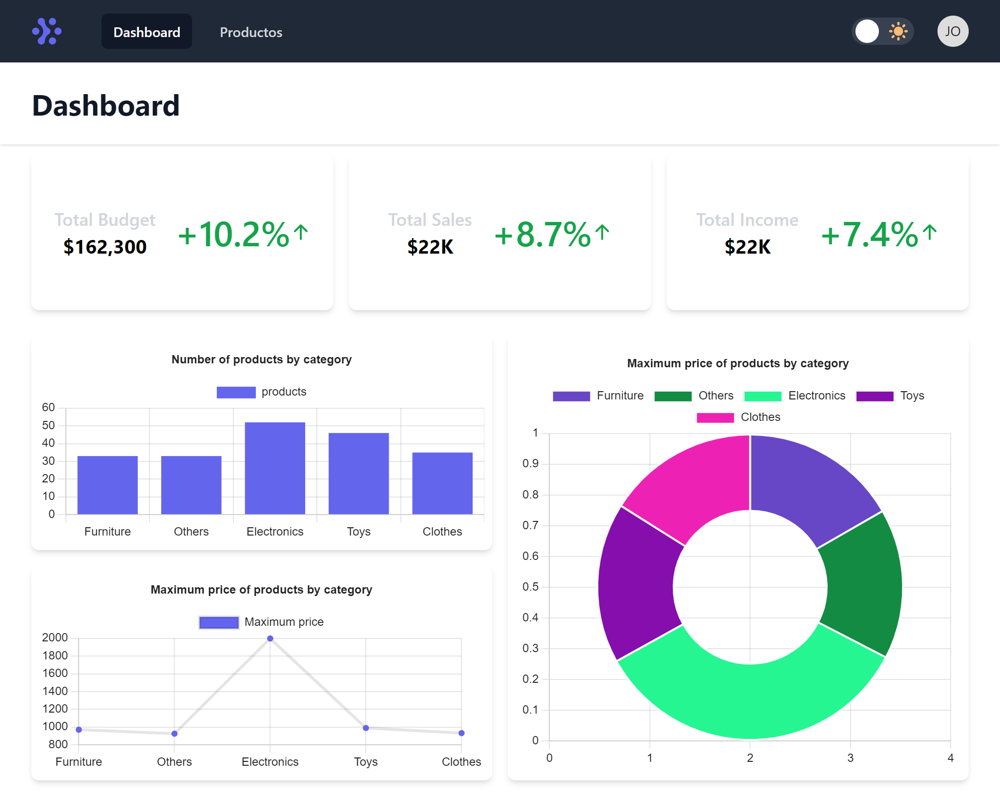

<!-- Please update value in the {}  -->

<h1 align="center">Product Dashboard</h1>

<!-- TABLE OF CONTENTS -->

## Table of Contents

- [Overview](#overview)
  - [Built With](#built-with)
- [Deploy](#deploy)
- [Features](#features)
- [How to use](#how-to-use)
- [Contact](#contact)

<!-- OVERVIEW -->

## Overview



Product Dashboard showing a list of products and graphics.

### Built With

<!-- This section should list any major frameworks that you built your project using. Here are a few examples.-->

- [Nextjs](https://nextjs.org/)
- [Tailwindcss](https://tailwindcss.com/)
- [Chartjs](https://www.chartjs.org/)
- [Typescript](https://www.typescriptlang.org/)

## Deploy
[Web site 🚀](dashboard-nextjs-13p6rj7a1-jmauricio22.vercel.app)

## Features

- [x] I can login
- [x] I can see a list of products
- [x] I can create, update and remove products
- [x] I can browse the list of paginated products
- [x] I can see graphics
- [x] I can switch to dark mode 


## How To Use

<!-- Example: -->

To clone and run this application, you'll need [Git](https://git-scm.com) and [Node.js](https://nodejs.org/en/download/) (which comes with [npm](http://npmjs.com)) installed on your computer. From your command line:

```bash
# Clone this repository
$ git clone https://github.com/JMauricio22/dashboard-nextjs.git

# Install dependencies
$ npm install

# Run the app
$ npm run dev
```

## Contact

- GitHub [@JMauricio22](https://github.com/JMauricio22)
